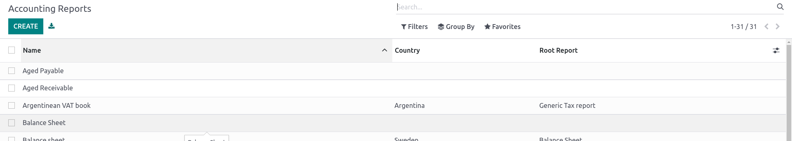
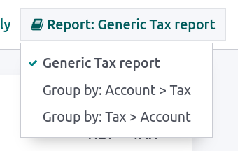
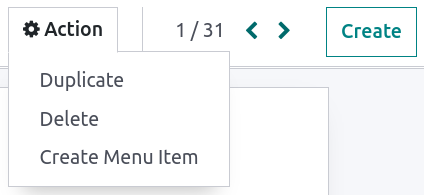
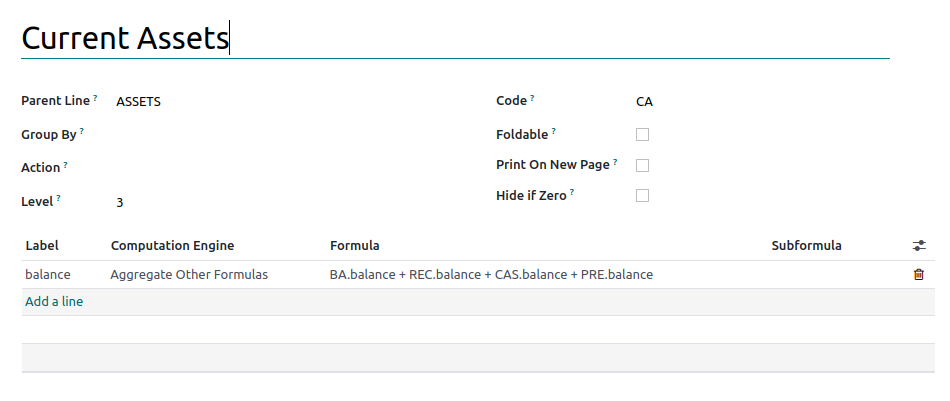
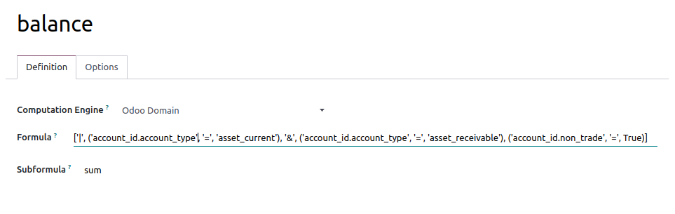
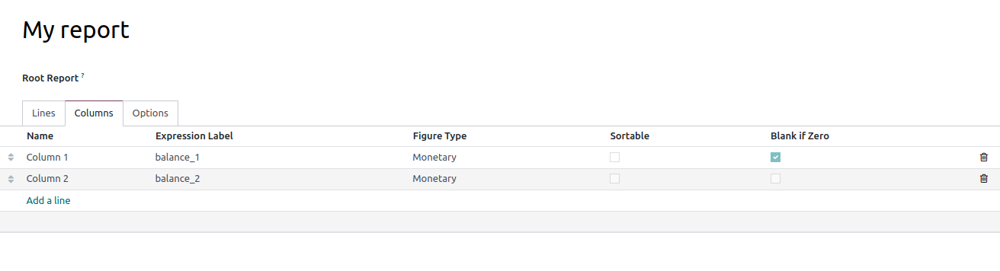
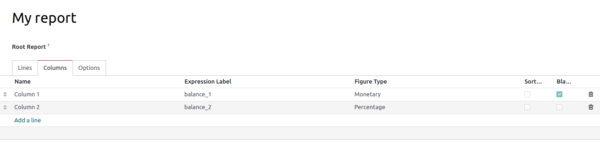
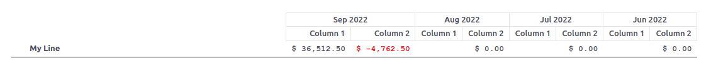

=================================================
Create a customized report with your own formulas
=================================================

Overview
========

Odoo comes with a powerful and easy-to-use reporting framework. The engine allows you to create new
reports such as **tax reports**, or **balance sheets** and **income statements** with **specific
groupings** and **layouts**.

.. important::
   In order to access the accounting report creation interface, the
   :ref:`developer mode <developer-mode>` has to be activated.

Create your report
==================

In order to create a new report, go to :menuselection:`Accounting --> Configuration --> Accounting
Reports`. From here, you can either create a **root report** or a **variant**.

Variants
--------

A variant always refers to a root report. When a report is open, all the variants available for its
root are displayed in the variant selector, in the top right corner of the view. In the following
image, :guilabel:`Generic Tax report` is the only variant.

Root reports
------------

If a report has no root report, it is considered to be a root report itself. When creating a new
root report, you need to create a **menu item** for it. To do so, **save** your report and then on
that same report, click on :menuselection:`Action --> Create Menu Item`. When done, refresh the page
and the report will be available under :menuselection:`Accounting --> Reporting`.

.. seealso::
    List of built-in :doc:`root reports <../overview/main_reports>`.

Lines
-----

After having created a report, you need to fill it with lines. They all need a **name**. You can
also give them a **code** if you wish to use their value in some formula. Multiple options are also
available to change the way the line is displayed.
 

Expressions
-----------

Each report line can declare multiple expressions. An expression can basically be seen as a
subvariable needed by a report line.

When creating an expression, you need to give it a **label**. This label must be unique amongst the 
expressions of each line, and is used to refer to it. You also must provide an **engine** and
**formula** (as well, depending on the engine, as a **subformula**).

The **engine** defines how your **formula** and **subformula** will be intepreted. Of course, you
are free to mix expressions using different engines under the same line if you need to.

'Odoo Domain' engine
~~~~~~~~~~~~~~~~~~~~

With this engine, a formula will be interpreted as an :ref:`Odoo domain <reference/orm/domains>`
targeting account.move.line objects.

The subformula allows you defining how the move lines matching the domain will be used to compute
the value of the expression:

- **sum** : The result is the sum of all the balances of the matched move lines

- **sum_if_pos** : The result is the sum of all the balances of the matched move lines if this
  amount is positive. Else, it's 0.

- **sum_if_neg** : The result is the sum of all the balances of the matched move lines if this
  amount is negative. Else, it's 0.

- **count_rows** : The result is the number of sublines of this expression. If the parent line has a
  group-by value, this will correspond to the number of distinct grouping keys in the matched move
  lines. Else, it will be the number of matched move lines.

You can also put a '-' sign at the beginning of the subformula to invert the sign of the result.

'Tax Tags' engine
~~~~~~~~~~~~~~~~~

A formula made for this engine consists of a name used to match tax tags. If such tags don't exist
when creating the expression, they will be created.

.. example::
   If formula is **tag_name**, the engine will match tax tags **+tag_name** and **-tag_name**,
   creating them if necessary.

When evaluating the expression, the expression computation can roughly be expressed as (amount of
the move lines with + tag) - (amount of the move lines with - tag).

'Aggregate Other Formulas' engine
~~~~~~~~~~~~~~~~~~~~~~~~~~~~~~~~~

Use this engine when you need to perform some arithmetic operation on the amounts obtained for other
expressions. Formula can be any expression with +, -, / and * operator. To refer to an expression,
use the code of its parent line and its label, like this: **CODE.label**.

**subformula** can be one of the following: 

- **if_above(CUR(amount))**: The value of the arithmetic expression will be returned only if it's
  greater than the provided bound. Else, the result will be 0.

- **if_below(CUR(amount))**: The value of the arithmetic expression will be returned only if it's
  lower than the provided bound. Else, the result will be 0.

- **if_between(CUR1(amount1), CUR2(amount2))**: The value of the arithmetic expression will be
  returned only if it's strictly between the provided bounds. Else, it will be brought back to the
  closest bound.

Where **CUR** is a currency code in capital letters, and **amount** is the amount of the bound,
expressed in this currency.

You can also use the **cross_report** subformula to match if your expression refers to an expression
defined in another report.

'Prefix of Account Codes' engine
~~~~~~~~~~~~~~~~~~~~~~~~~~~~~~~~

This engine is used to match amounts put on accounts using the prefixes of these accounts' codes as
variables in an arithmetic expression.

.. example::
   **21 + 10 - 5**
     will add the balances of the move lines made on accounts whose codes start with '21' and '10',
     and substract the balance of the ones on the accounts prefixed '5'.

It is also possible to ignore some subprefixes.

.. example::
   **21 + 10\\(101, 102) - 5\\(57)**
     will do the same as the previous example, but ignoring the prefixes '101', '102' and '57'.

You can apply finer treatment on debits/credits using C and D suffixes. In this case, an account
will only be considered if its prefix matches and the total balance of the move lines made on this
account is credit/debit.

.. example::
   Account 210001 has a balance of -42 and account 210002 has a balance of 25.
   The formula **21D** will only match account 210002, and hence return 25. 210001 will not be
   matched, as its balance is credit.
   
It is of course possible to mix prefix exclusion with D/C suffixes.

.. example::
   **21D + 10\\(101, 102)C - 5\\(57)**

To match letter C or D in a prefix and not use it as suffix, use an empty exclusion.

.. example::
   **21D\\()**
     will match accounts whose code starts with '21D', regardless of their balance sign.    

'External Value' engine
~~~~~~~~~~~~~~~~~~~~~~~

The 'external value' engine is used to refer to manual and carryover values. Those values are note
stored using account.move.line, but with another object (account.report.external.value). Each of
these objects directly points to the expression it impacts, so very few needs to be done about their
selection here.

**formula** can be one of the following: 

- **sum** : If the result must be the sum of all the external values in the period.

- **most_recent**: If the result must be the value of the latest external value in the period.

In addition, **subformula** can be used in two ways:

- **rounding=X** : Replacing X by a number, will tell to round the amount to X decimals

- **editable** : Will tell this expression can be edited manually, triggering the display of an icon
  in the report allowing the user to perform this action.

Both those subformulas can be mixed, by separating them with a ';'.

.. example::
   **editable;rounding=2**
     is a correct subformula, mixing both behaviors.

'Custom Python Function' engine
~~~~~~~~~~~~~~~~~~~~~~~~~~~~~~~

This engine is a means for developers to introduce custom computation of expressions on a
case-by-case basis. The formula is then the name of a python function to call, and subformula is a
key to fetch in the dictionary returned by this function. Use it only if you are making a custom
module of your own.

Columns
-------

Each report can define any number of columns to display.

Each column gets its values from the expressions declared on the lines. The field
**expression_label** of the column gives the label of the expressions whose value will be displayed.
If a line has no expression with this label, then nothing will be displayed for it in this column.
If you need multiple columns, you just have to use different expression labels; it's that simple.

When using the period comparison feature, the whole block of columns will be repeated in each
period.

