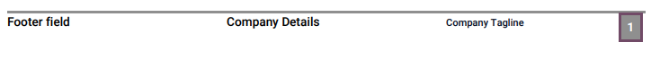

===========
PDF reports
===========

Odoo uses HTML and CSS technologies to create reports (PDF documents). HTML elements provide the
basic structure while CSS interacts with the elements to establish how they are shown to the user.
Odoo also uses Bootstrap, a CSS framework, for the grid layout.

.. _studio/pdf-reports/default-layout:

Default layout
==============

The default layout of reports is managed outside Studio. Go to :menuselection:`Settings -->
Companies: Document Layout --> Configure Document Layout`. Layout settings apply to all reports, but
only of the current company.

.. print button seems to let you configure all your documents as well and then download it once configured?

.. tip::
   Use :guilabel:`Download PDF Preview` to view how the different settings affect the layout of a
   sample invoice.

.. _studio/pdf-reports/default-layout/layout:

Layout
------

Four layouts are available.

.. tabs::

   .. tab:: Light

      .. image:: pdf_reports/light.png
         :align: center
         :alt: Light report layout sample

   .. tab:: Boxed

      .. image:: pdf_reports/boxed.png
         :align: center
         :alt: Boxed report layout sample

   .. tab:: Bold

      .. image:: pdf_reports/bold.png
         :align: center
         :alt: Bold report layout sample

   .. tab:: Striped

      .. image:: pdf_reports/striped.png
         :align: center
         :alt: Striped report layout sample

.. _studio/pdf-reports/default-layout/font:

Font
----

Seven fonts are available. Click on the links below to preview them on Google Fonts.

- `Lato <https://fonts.google.com/specimen/Lato#type-tester>`_
- `Roboto <https://fonts.google.com/specimen/Roboto#type-tester>`_
- `Open Sans <https://fonts.google.com/specimen/Open+Sans#type-tester>`_
- `Montserrat <https://fonts.google.com/specimen/Montserrat#type-tester>`_
- `Oswald <https://fonts.google.com/specimen/Oswald#type-tester>`_
- `Raleway <https://fonts.google.com/specimen/Raleway#type-tester>`_
- `Tajawal <https://fonts.google.com/specimen/Tajawal#type-tester>`_

  .. tip::
     :guilabel:`Tajawal` supports both Arabic and Latin scripts.

.. _studio/pdf-reports/default-layout/logo:

Company Logo
------------

Upload an image file to add a :guilabel:`Company Logo`.

.. note::
   This adds the logo to the company’s record on the *Company* model, which you can access by going
   :menuselection:`General Settings --> Companies --> Update Info`.

.. _studio/pdf-reports/default-layout/colors:

Colors
------

Change the primary and secondary colors which are used throughout reports to highlight important
elements. The default colors are automatically generated based on the colors of the logo.

.. _studio/pdf-reports/default-layout/background:

Layout Background
-----------------

Change the background image of the report:

- :guilabel:`Blank`: no image is used, the background is empty.
- :guilabel:`Geometric`: an image featuring geometric shapes is added to the background.
- :guilabel:`Custom`: use a custom background image by uploading one.

.. _studio/pdf-reports/default-layout/tagline:

Company Tagline
---------------

The :guilabel:`Company Tagline` is displayed on the header of :ref:`External reports
<studio/pdf-reports/header-footer/external>`. You can add multiple lines of text.

.. _studio/pdf-reports/default-layout/details:

Company Details
---------------

The :guilabel:`Company Details` are displayed on the header of :ref:`External reports
<studio/pdf-reports/header-footer/external>`. You can add multiple lines of text.

.. _studio/pdf-reports/default-layout/footer:

Footer
------

Use the :guilabel:`Footer` field to put any text in the :ref:`External reports'
<studio/pdf-reports/header-footer/external>` footers. You can add multiple lines of text.

.. _studio/pdf-reports/default-layout/paper:

Paper format
------------

Use the :guilabel:`Paper format` field to change the paper size of reports. You can either select
:guilabel:`A4` (21 cm x 29.7 cm) or :guilabel:`US Letter` (21.59 cm x 27.54 cm).

.. tip::
   You can change the :guilabel:`Paper format` on individual reports. Open the app containing the
   report, then :menuselection:`Toggle Studio --> Reports --> Select or Create a report --> Report
   --> Select a Paper format`.

.. _studio/pdf-reports/header-footer:

Header and footer
=================

When creating a new report in Studio, you first have to choose between one of three styles of
reports. This is solely used to determine what is displayed on the header and footer.

.. _studio/pdf-reports/header-footer/external:

External
--------

The header displays the company :ref:`studio/pdf-reports/default-layout/logo` and several values
set on the *Company* model: the :guilabel:`Company Name`, :guilabel:`Phone`, :guilabel:`Email`, and
:guilabel:`Website`.

.. tip::
   To change a company's information, go to :menuselection:`Settings --> Companies --> Update Info`.

The footer displays the values set on the :ref:`studio/pdf-reports/default-layout/footer`,
:ref:`studio/pdf-reports/default-layout/details`, and
:ref:`studio/pdf-reports/default-layout/tagline` fields, as well as the page number.

.. _studio/pdf-reports/header-footer/internal:

Internal
--------

The header displays the user's current date and time, :guilabel:`Company Name`, and page number.

There is no footer.

.. _studio/pdf-reports/header-footer/blank:

Blank
-----

There is neither a header nor a footer.

.. _studio/pdf-reports/elements:

Add elements
============

After opening an existing report or creating a new one, go to the :guilabel:`Add` tab to add or edit
elements. The elements are organized in four categories: :ref:`studio/pdf-reports/elements/block`,
:ref:`studio/pdf-reports/elements/inline`, :ref:`studio/pdf-reports/elements/table`, and
:ref:`studio/pdf-reports/elements/column`.

.. _studio/pdf-reports/elements/block:

Block
-----

Block elements start on a new line and occupy the full width of the page.

.. tip::
   You can set an element's width by selecting it and going to the :guilabel:`Options` tab if you do
   not want it to use the full width.

- :guilabel:`Text`: used to add any text using a small font size by default.

- :guilabel:`Title Block`: used to add any text using a larger font size by default.

- :guilabel:`Image`: used to add an image. You can either upload one from your device, add one from
  an URL, or select one already existing on your database.

- :guilabel:`Field`: used to dynamically add a field's value.

- :guilabel:`Field & Label`: used to dynamically add a field's value and label.

- :guilabel:`Address Block`: used to to dynamically add the values, if any, of a contact's: *Name*,
  *Address*, *Phone*, *Mobile*, and *Email*.

  .. image:: pdf_reports/address-block.png
     :align: center
     :alt: Example of an Address Block

.. _studio/pdf-reports/elements/inline:

Inline
------

Inline elements are used around other elements. They do not start on a new line and only occupy the
width they require.

.. tip::
   You can set an element's width and margins by selecting it and going to the :guilabel:`Options`
   tab.

- :guilabel:`Text`: used to add any text using a small font size by default.

- :guilabel:`Field`: used to add a field's value.

.. _studio/pdf-reports/elements/table:

Table
-----

Table elements are used together to create a data table.

- :guilabel:`Data table`: used to create the table and dynamically add a first column displaying the
  *Name* values of a :ref:`Many2Many <studio/fields/relational-fields/many2many>` or :ref:`One2Many
  <studio/fields/relational-fields/one2many>` field on your model.

  .. image:: pdf_reports/data-table.png
     :align: center
     :alt: Example of a Data table

- :guilabel:`Field Column`: used to add a new column to the table displaying the values of a
  :ref:`Related Field <studio/fields/relational-fields/related-field>` to the one used to create the
  :guilabel:`Data table`.

- :guilabel:`Text in Cell`: used to add any text within an existing table cell.

- :guilabel:`Field in Cell`: used to add, within an existing table cell, the values of a
  :ref:`Related Field <studio/fields/relational-fields/related-field>` to the one used to create the
  :guilabel:`Data table`.

- :guilabel:`Subtotal & Total`: used to add an existing :guilabel:`Total` field's value. If a
  :guilabel:`Taxes` field exist, the untaxed and taxes amounts are added before the total amount.

.. _studio/pdf-reports/elements/column:

Column
------

Columns are used to add multiple text :ref:`blocks <studio/pdf-reports/elements/block>` on the same
line.

- :guilabel:`Two Columns`: used to add any text in two different columns the same line.

- :guilabel:`Two Columns`: used to add any text in three different columns the same line.

